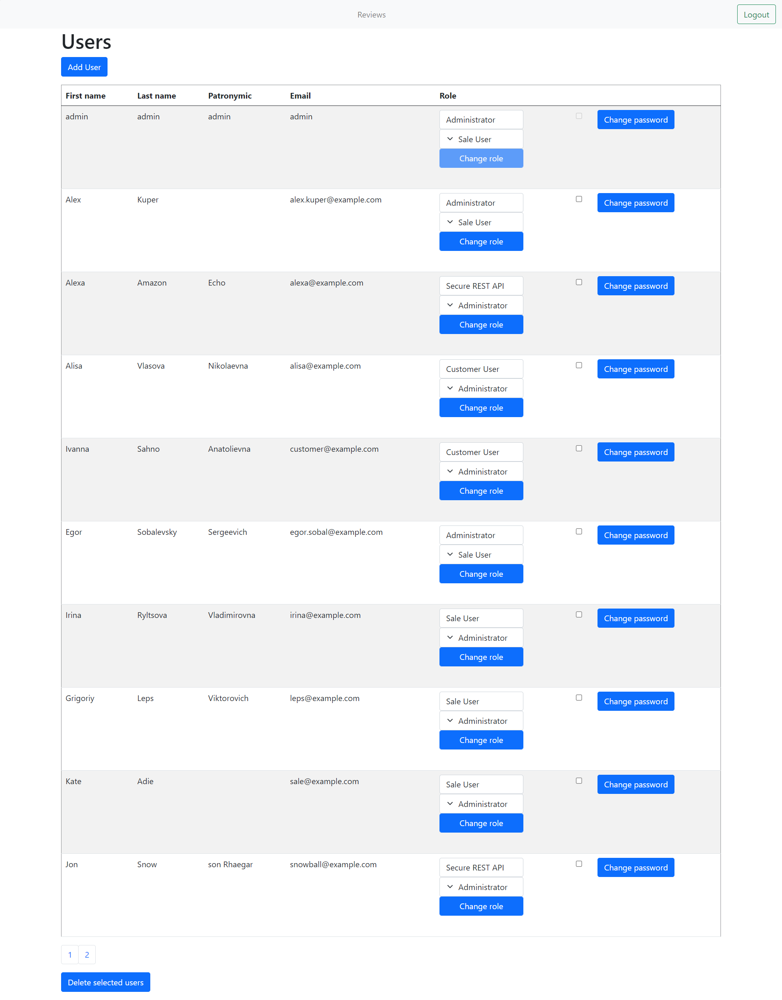
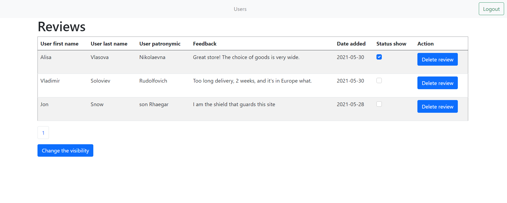
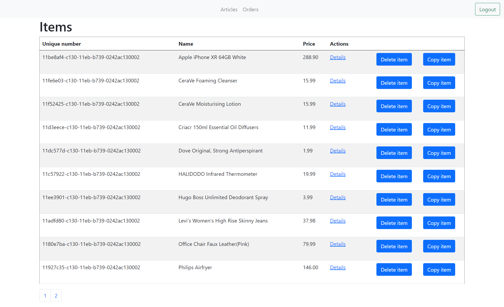
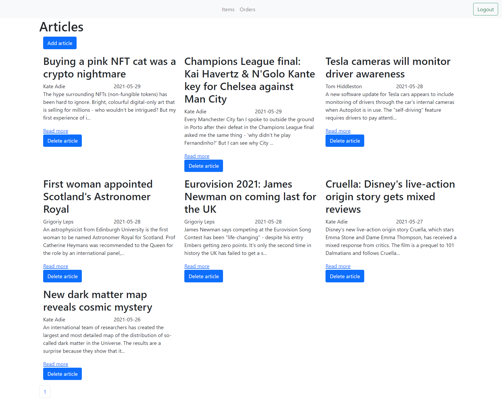
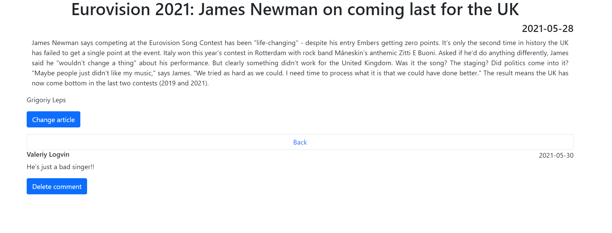
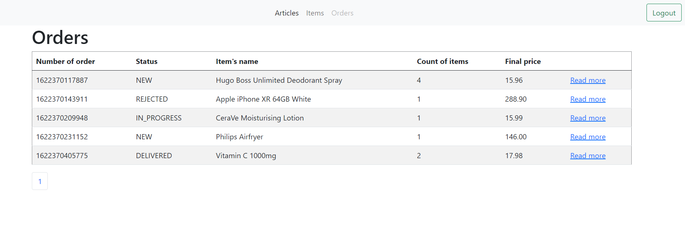
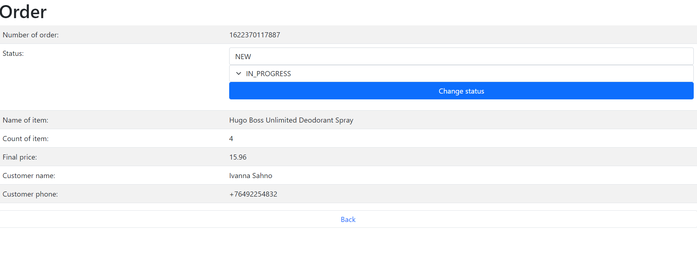

# courseproject

> Outline a brief description of your project.
> Live demo [_here_](https://www.example.com).
<!--ссылка на хероку
If you have the project hosted somewhere, include the link here. -->

## Table of Contents
* [General Info](#general-information)
* [Technologies Used](#technologies-used)
* [Features](#features)
* [Screenshots](#screenshots)
* [Setup](#setup)
* [Project Status](#project-status)
* [Room for Improvement](#room-for-improvement)
* [Acknowledgements](#acknowledgements)
* [Contact](#contact)
<!-- * [License](#license) -->

## General Information
- Provide general information about your project here.
- What problem does it (intend to) solve?
- What is the purpose of your project?
- Why did you undertake it?

## Technologies Used
- Java 11 
- Apache Maven 3.6.3
- Spring Boot version 2.4.2
- Hibernate version 5.4.27
- MySql version 8.0.22
- Liquibase version 3.10.3
- Thymeleaf
- Docker 
- JUnit tests

## Features
The project was completed on the basis of the provided technical specifications:   
[Technical requirement Part 1](https://drive.google.com/file/d/1m2U3jTP7U_7-dGgwy0wrM0xnL0Qv3UJL/view?usp=sharing)   
[Technical requirement Part 2](https://drive.google.com/file/d/1zkA6g8y3KUCFC7zA_wO0GbW5To0AhG6_/view?usp=sharing)   
[Technical requirement Part 3](https://drive.google.com/file/d/11R7hRtuaYcbfybbuRA4LJp6840P6nXZG/view?usp=sharing)   
[Technical requirement Part 4](https://drive.google.com/file/d/1e9PlxdckWu0Mrd_M1qT-xkPCvoGJE9JQ/view?usp=sharing)   

## Screenshots

## Setup
- Install Java SE Development Kit 11
- Install maven
- Install and run Docker
- Build the package with maven with the command `mvn clean package`
- Run the provided [docker-compose](/docker-compose.yml) file.
- Go to the address in your browser [localhost:8080/login](http://localhost:8080/login)

## Project Status

Project is: _complete_.  
Project has been completed at the end of the Java enterprise development course.

## Room for Improvement

Room for improvement:
- Add the ability to write comments on articles
- Add a page to view user's feedback on the site

## Acknowledgements

- This project was suggested by the IT academy course tutor Artsiom Peravoznikay as a course project
- Many thanks to IT-academy, the course tutor Artsiom Peravoznikay and my fellow students.

## Contact
Created by hanna.sapeha@protonmail.com - feel free to contact me!
